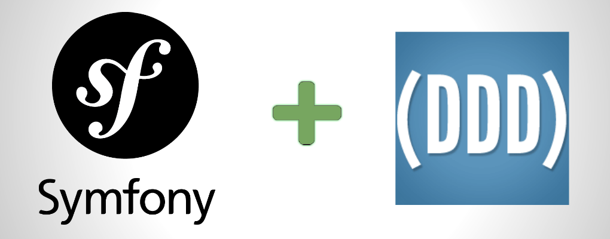
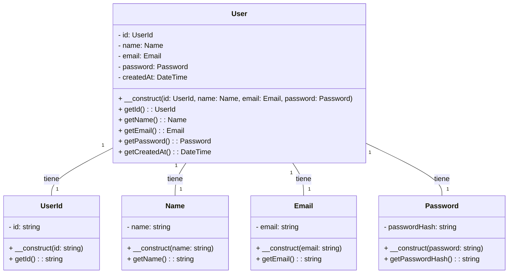
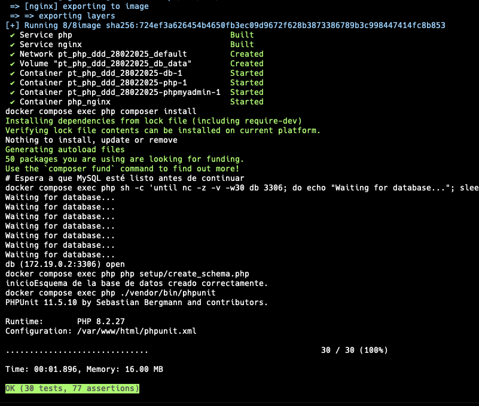
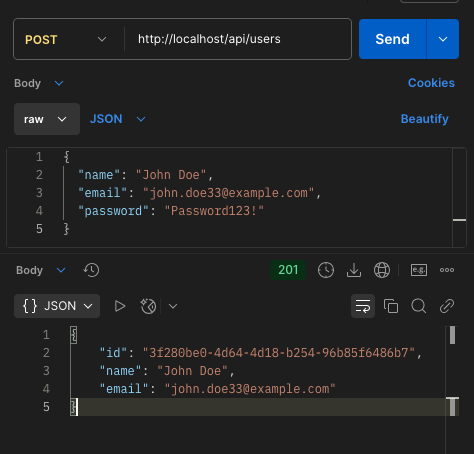
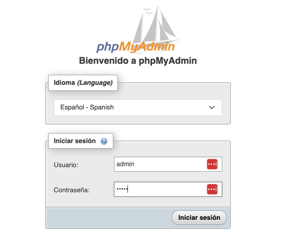
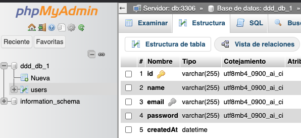

<div align="center">
    

<br>

<h1 align="center">
  DDD, PHP y Clean Architecture
</h1>


[](https://github.com/usuario/repo/releases) [](https://opensource.org/licenses/MIT) [](https://github.com/usuario/repo/actions)<br>**by [Javier Solis 🧑‍💻🤖🚀🎯🔍](#contact)**


</div>

<div align="center">
API REST para registro de usuarios, implementada con <b>PHP, Slim Framework y Doctrine ORM, siguiendo la metodología DDD</b> .

  <br>
  <a href="https://github.com/CodelyTV/php-ddd-example/stargazers">Las estrellas son bienvenidas ⭐️</a>

  <a href="https://github.com/CodelyTV/php-ddd-example/issues">Solicitar un feature 🚀</a>
  
</div>


## 🚀 Setup del entorno

### 🐳 Herramientas necesarias

1. [Instalar Docker](https://www.docker.com/get-started)
2. Clonar el proyecto: `git clone https:// php-ddd-jsolis`
3. Move to the project folder: `cd php-ddd-jsolis`


### 🔥 Ejecución

1. Instalar todas las dependencias, ejecutar el contenedo y ejecutar los test para verificar: `make build`
   
2. Entonces si todo fue bien, tiene disponible (Interactuar con el shell, 1 APIs y el PhpAdmin):
   
   2.1.  Shell de Php: `make exec`
   
   2.2. [Api](http://localhost/api/users): http://localhost/api/users , ejemplo: 
   
   ```shell

   curl --location 'http://localhost/api/users' \
    --header 'Content-Type: application/json' \
    --header 'Accept: application/json' \
    --data-raw '{
      "name": "John Doe",
      "email": "john.doe33@example.com",
      "password": "Password123!"
    }'
   
   ```

   2.3. [PhpAdmin](http://localhost:8181) :  http://localhost:8181 `User:admin / Pass:admin`


### 🏛 Arquítectura del proyecto

```scala
$ tree -L 4 setup src config
-L [error opening dir]
4 [error opening dir]
setup
└── create_schema.php
src
├── Application
│   ├── EventListener
│   │   └── SendWelcomeEmail.php
│   └── UseCase
│       └── RegisterUser.php
├── Domain
│   ├── Entity
│   │   └── User.php
│   ├── Event
│   │   └── UserRegistered.php
│   ├── Repository
│   │   └── UserRepositoryInterface.php
│   └── ValueObject
│       ├── Email.php
│       ├── Name.php
│       ├── Password.php
│       └── UserId.php
├── Infrastructure
│   ├── Exceptions
│   │   ├── InvalidEmailException.php
│   │   ├── UserAlreadyExistsException.php
│   │   ├── UserNotFoundException.php
│   │   └── WeakPasswordException.php
│   ├── Persistence
│   │   └── Entity
│   │       └── UserPersistence.php
│   └── Repository
│       └── DoctrineUserRepository.php
└── Presentation
    ├── Controller
    │   └── RegisterUserController.php
    └── DTO
        └── UserResponseDTO.php
config
├── bootstrap.php
├── doctrine.php
└── events.php
```

### 👓 Entidad+ValueObjects



## 🙋🏻 Características

* Endpoint REST para registro de usuarios (`/api/users`).
* Validación de datos de entrada (email, contraseña, etc.).
* Manejo de excepciones específicas (`InvalidEmailException`, `WeakPasswordException`, `UserAlreadyExistsException`).
* Despacho de eventos (`UserRegistered`).
* Pruebas unitarias y de integración.
* Configuración de Docker para un despliegue sencillo.
* Controladores desacoplados que actúan como adaptadores.
* Formato de respuesta JSON con DTO.

## 🎮 Tecnologías

* PHP 8.1
* Slim Framework
* Doctrine ORM
* PHPUnit
* Docker
* Composer


## 📺 Capturas

### - Salida terminal de `make buid``
  

### - Endpoint probado en Postman
   

### - PhpAdmin:
   Web:
   
   Tabla:
   


---

# Contact

<div align="center">
    
   

#### Javier Solis

👓 https://www.linkedin.com/in/android-developer-peru/

💼 https://www.behance.net/JavierJSolis

</div>